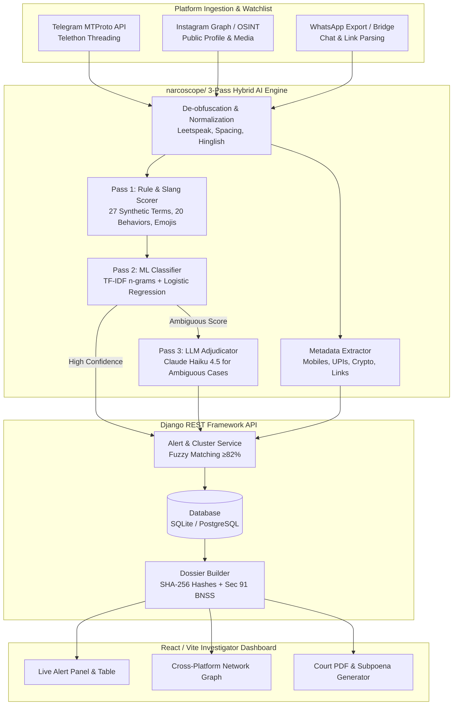

# 🛡️ NarcoScope AI — Intelligent Drug-Trafficking Detection & Triangulation System

[](https://sih.gov.in)
[](https://www.python.org)
[](https://www.django-rest-framework.org)
[](https://vitejs.dev)
[](LICENSE)

**NarcoScope AI** is an advanced, production-grade OSINT intelligence platform developed for law enforcement agencies to identify, track, and triangulate synthetic drug trafficking operations across **Telegram**, **WhatsApp**, and **Instagram** in India.

Designed specifically to solve **Smart India Hackathon (SIH) Problem Statement #01**, NarcoScope AI combines automated cross-platform ingestion, 3-pass hybrid AI/NLP content classification, custom Telegram bot fingerprinting, fuzzy cross-platform identity linking, and automated **Section 91 BNSS (CrPC)** legal subpoena generation into a unified investigator dashboard.

---

## 🌟 Key Innovations & Features

### 1. 🔍 Triangulation & Identifiable PII Extraction
* **Indian Mobile Number Extraction:** Compile-time regex detecting 10-digit Indian mobile numbers (prefixes `6-9`), including numbers embedded inside UPI VPAs (e.g., `9876543210@upi` automatically parses out `9876543210`).
* **Financial & Crypto Tracking:** Identifies **30+ Indian UPI payment provider handles** (`@okaxis`, `@paytm`, `@okhdfcbank`, `@ybl`, `@oksbi`, etc.) and Cryptocurrency wallet addresses (**Bitcoin** `bc1`/`13`, **Ethereum/USDT** `0x`).
* **Cross-Platform Handle Resolution:** Automatically extracts and maps external Telegram (`t.me/`), WhatsApp (`wa.me/chat.whatsapp.com/`), and Instagram handles from public bios and broadcast messages.

### 2. 🤖 Custom Bot Fingerprinting & Automation Detection
* **Storefront Signature Analysis:** Detects customized Telegram bots used for automated drug sales via command patterns (`/start`, `/menu`, `/price`, `/order`, `/catalog`, `/stock`) and command-to-message ratios (`bot_cmd_ratio > 0.3`).
* **Burst Posting & Cadence Analysis:** Detects high-frequency automated posting schedules and flags automated seller behaviors directly in the investigator inspector drawer.

### 3. 🚨 Real-Time Alert Engine & Fuzzy Operator Matching
* **Automated Risk Triage:** Generates database-backed alerts for `HIGH` and `CRITICAL` accounts with full status tracking (`new`, `acknowledged`, `dismissed`).
* **Fuzzy Cross-Platform Matching:** Uses `difflib.SequenceMatcher` across discovered accounts to identify similar usernames across platforms (e.g., matching `@candyshop_bot` on Telegram with `@candyshop.plug` on Instagram at **≥82% similarity**), flagging them as the **same real-world operator**.

### 4. ⚖️ Court-Ready Legal Dossier & Section 91 BNSS Subpoena
* **Section 91 BNSS / CrPC Production Order:** One-click generation of a pre-filled legal request template addressed to the Law Enforcement Portals of **Telegram Messenger Inc.**, **Meta Platforms / Instagram**, and **WhatsApp LLC**, demanding registered subscriber IP logs, phone numbers, and IMEI/MAC records.
* **Tamper-Proof Electronic Evidence:** Computes a **SHA-256 cryptographic hash** over the UTF-8 bytes of every captured message, ensuring full compliance with **Section 63 of the Bharatiya Sakshya Adhiniyam, 2023 (BSA)** for electronic evidence admissibility in Indian courts.

---

## 🏗️ System Architecture & Workflow

NarcoScope AI operates as a clean **3-Tier Architecture**:
1. **OSINT Engine (`narcoscope/`)**: Pure Python NLP processing, weak-supervision labeling, and ML classification pipeline.
2. **Backend REST API (`backend/`)**: Django REST Framework managing background ingestion threads, alert persistence, SQLite/PostgreSQL storage, and legal dossier compilation.
3. **Frontend Dashboard (`frontend/`)**: Modern Vite/React Single Page Application (SPA) with real-time alert polling, interactive network graphs, and printable PDF reports.



---

## 🛠️ Technology Stack & APIs Used

### 1. External APIs & Cloud Integrations
* **Telegram MTProto API (`telethon`):** Connects directly to Telegram's official servers via `api_id` and `api_hash` to monitor channels, bots, and public groups in real time without browser scraping.
* **Anthropic Claude API (`anthropic`):** Calls **Claude Haiku 4.5** (via `ANTHROPIC_API_KEY`) as the Pass 3 adjudicator exclusively for messages where the ML stage is uncertain (bounded cost, high accuracy).
* **Instagram Graph API / OSINT (`instaloader`):** Ingests public profile bios, captions, and external link trees.
* **WhatsApp Chat Exporter:** Ingests lawfully obtained exported group chats and link invitations.

### 2. Core Technologies
* **Frontend:** React 18, Vite 8, Vanilla CSS (Glassmorphism & dark-mode design system), Chart.js / SVG Network Graph visualization.
* **Backend:** Python 3.11+, Django 6.0, Django REST Framework (DRF), Gunicorn, WSGI/ASGI background thread workers.
* **Machine Learning & NLP:** Scikit-Learn (TF-IDF Vectorizer + Logistic Regression), NumPy, Joblib, Regex Compile-Time Automata.
* **Containerization & DevOps:** Docker, Docker Compose, Nginx Reverse Proxy, Vercel & Render PaaS blueprints.

---

## 📋 SIH Problem Statement #01 Compliance Matrix

| Requirement | How NarcoScope AI Solves It | Status |
| :--- | :--- | :---: |
| **1. Platform Usage Study** | Models Telegram channels, custom sales bots, WhatsApp groups, and Instagram profiles with distinct schema handling. | ✅ **Complete** |
| **2. Dynamic Keyword DB** | Expanded dictionary with 27 synthetic drugs (MDMA, LSD, Mephedrone, Fentanyl, Cocaine), 20 Indian behaviors (`bulk maal`, `thok bhav`, `doorstep delivery`, `crypto payment`), 12 emojis, and Hinglish de-obfuscation. | ✅ **Complete** |
| **3. Real-Time Monitoring** | Background threading via `TelegramWatch` and `IngestJob` continuously polls watchlist channels and triggers automated scans. | ✅ **Complete** |
| **4. AI/NLP Content Engine** | 3-Pass Hybrid architecture: Rules ➔ ML (TF-IDF + Logistic Regression) ➔ LLM (Claude Haiku 4.5) with full explanation traces. | ✅ **Complete** |
| **5. Bot & Automation Detection** | Identifies automated storefronts via `/command` patterns, command ratios (`>0.3`), and burst posting cadence analysis. | ✅ **Complete** |
| **6. PII & Metadata Triangulation** | Automated extraction of Indian mobiles, emails, UPI IDs (with embedded phones), crypto wallets, and cross-platform links. | ✅ **Complete** |
| **7. Real-World Identity Linking** | Correlates shared UPI payment handles into `LinkedCluster` graphs + **Fuzzy Handle Matching** (≥82% similarity across platforms). | ✅ **Complete** |
| **8. Investigator Dashboard** | Interactive React UI featuring alert triage, risk-band filtering, network graph visualization, and model accuracy metrics. | ✅ **Complete** |
| **9. Alert Mechanism** | Real-time database alerts with severity grading (`CRITICAL`/`HIGH`), pulsing UI badges, and one-click Acknowledge/Dismiss triage. | ✅ **Complete** |
| **10. Legal & Privacy Compliance** | No unlawful interception. Packages public OSINT into an official **Section 91 BNSS Subpoena template** with **SHA-256 evidence hashing** (Sec 63 BSA). | ✅ **Complete** |

---

## 🚀 Quick Start & Installation

### Option 1: Local Development (Recommended for Hackathons)
No cloud keys or external dependencies required to run the sample dataset!

**1. Clone the repository:**
```bash
git clone https://github.com/CodeVishal-17/narcoscopeAI_.git
cd narcoscopeAI_
```

**2. Start the Django Backend:**
```bash
python -m venv venv
# On Windows: venv\Scripts\activate
# On Linux/Mac: source venv/bin/activate

pip install -r backend/requirements.txt
python backend/manage.py migrate
python backend/manage.py runserver 8001
```

**3. Start the Vite React Frontend:**
```bash
cd frontend
npm install
npm run dev -- --port 5173
```
Open your browser at **http://localhost:5173/**.

---

### Option 2: Docker Compose (1-Command Server Deployment)
To deploy the entire system (Frontend + Backend + Database + Nginx) on any Linux server or cloud VM:

```bash
git clone https://github.com/CodeVishal-17/narcoscopeAI_.git
cd narcoscopeAI_

# Launch all containers in the background:
docker compose up -d
```
* **Frontend Web UI:** `http://localhost/` (Port 80)
* **Backend API & Admin:** `http://localhost:8001/api/`

---

### Option 3: Free Cloud PaaS Deployment (Vercel + Render)
The repository includes zero-config blueprints (`render.yaml` and `vercel.json`) for instant 1-click cloud deployment:

1. **Backend on Render.com:**
   * Create a new Blueprint project and connect your GitHub repo.
   * Render automatically deploys Gunicorn and SQLite. Copy your live backend URL (e.g., `https://narcoscope-backend.onrender.com`).
2. **Frontend on Vercel.com:**
   * Import the repo and select the `frontend` folder as Root Directory.
   * Add Environment Variable: `VITE_API_BASE_URL` = `https://narcoscope-backend.onrender.com`.
   * Click **Deploy**!

---

## 📖 Local CLI & Model Training Commands

NarcoScope AI can also be used as a standalone command-line OSINT analysis toolkit:

```bash
# 1. Bootstrap and train the machine learning model from rules + synthetic data:
python -m narcoscope.train

# 2. Run the end-to-end analysis pipeline on sample or scraped data:
python -m narcoscope.pipeline sample_data.json

# 3. Launch the interactive keyboard-driven data labeling tool (http://127.0.0.1:8100):
python -m narcoscope.labeling.server

# 4. Scrape live Telegram channels (requires TELEGRAM_API_ID & TELEGRAM_API_HASH):
python -m narcoscope.scrape telegram @channel_name -o data/tg_dump.json
```

---

## 📜 Legal & Ethical Notice
This software is built strictly for **Law Enforcement Agencies (LEAs)** and authorized researchers. It operates entirely on publicly accessible OSINT broadcasts and lawfully obtained data exports. It does not perform unauthorized hacking, wiretapping, or private data scraping. All subscriber identification procedures adhere strictly to lawful process under the **Bharatiya Nagarik Suraksha Sanhita (BNSS), 2023** and the **Code of Criminal Procedure (CrPC)**.

---
**Developed with ❤️ for Smart India Hackathon 2025**